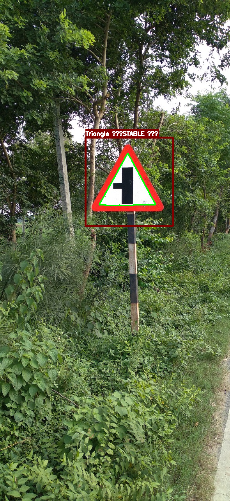

# Traffic-Sign-shape-detector
This project detects traffic signs and their shape
  We trained YOLO v8 model to detect traffic sign in the frame and then used opencv to find countour and then find the shape of the detected sign
  we used [this](dataset)
# Installation
-<b>`pip install -r requirements.txt`</b>
# To run the code on test image on webcam:
-<b>`python run_on_images.py --weights models/best.pt --source test_images/image1.jpg`</b>
   Here is the result:
 

